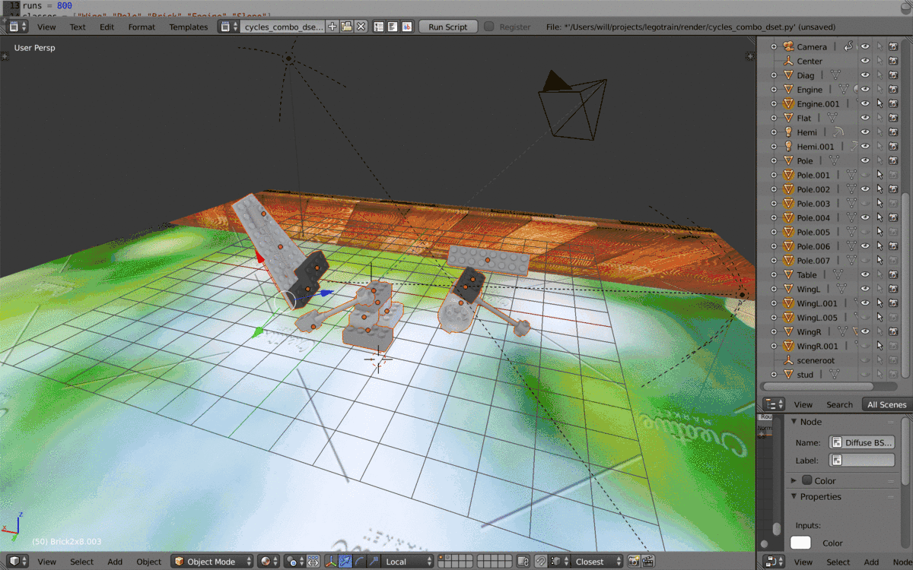
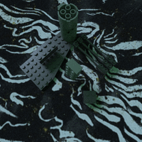
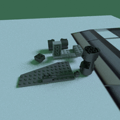
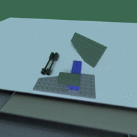
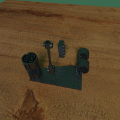
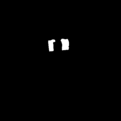
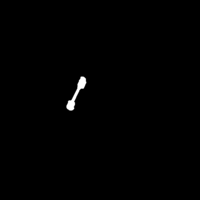
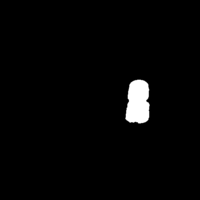

# Rendering AI lego designer agents

We'll use blender to render actions taken by an RL level designer.

# Installation

- Download and install blender (tested with 3.4).
- Open `render/brick_generator.blend` in blender. You can launch blender from the command line with the `/Applications/Blender.app/Contents/MacOS/blender` (or similar).
- In blender, select scripting mode and open the file `render/render_env.py`, and run the script. The first time you run the script, make sure `INSTALL = True` in `render_env.py`. This installs modules in `requirements.txt` in blender's built-in version of python (3.10). After the first time running this script, you can set this back to False.

You can edit scripts in external editors and reload them in blender. To make this reloading happen automatically, run the script `render/auto_reload.py` from inside blender.

Currently, the file `render_env.py` renders actions sampled randomly from a simple environment. In the `LegoEnv` environment, the agent can place
rectangular bricks on a grid. Bricks that would overlap with existing bricks, or would end up floating in mid-air, are disallowed. (In other words, the agent can place bricks on the ground, or coneected to another brick -- below or above -- via studs.) Of not in the environment is the `grid` attribute, which is a 3D grid in which each cell is the size of the smallest possible brick (1x1x1 -- 1 stud on a plate 1 third the height of a standard brick). When a brick is placed such that it occupies a cell in this grid, this cell's value is changed from 0 (if it was previously empty) to the brick's unique ID (for now, this is "1" if the brick was the first placed on the grid, "3" if it was the 3rd, etc). Meanwhile, the `bricks` attribute is a dictionary mapping brick IDs to their positions and sizes.

Currently, the environment returns a reward of -1 when the agent attempts to place an overlapping or floating brick, and 0 otherwise.

## Optional: Make an alias to the blender command

To make an alias to launch Blender from anywhere, you can use the following command in your terminal:

```bash
alias blender="/Applications/Blender.app/Contents/MacOS/blender"
```

This will create a shortcut for the full path of the Blender executable. You can replace /Applications/Blender with your actual Blender installation directory. You can also add this command to your ~/.bashrc or ~/.zshrc file to make it permanent.

Now you can type `blender` in any directory and it will launch Blender.

Below is the upstream readme:


# Lego Renderer for Machine Learning Projects


A set of Python scripts/Blender utilities for rendering Lego scenes for use in deep learning/computer vision projects.
Includes a basic scene with a tracked camera, scripts for rendering images, normals, masks of Lego combinations, and utilities for recording the positions of special features on different pieces (studs, corners, holes) easily.





      


      


## Folders and Files:

* render
  * renderbench.blend: Blend file containing a camera view-locked to the center of the scene and a surface with an adjustable image texture.  Also comes with a compositor rigged for rendering depth, normals, and mask layers to EXR files.

  * combo_dset.py: Script for rendering images of Lego structure permutations.  Works by hiding a random subset of pieces in the scene, randomly setting the material values of the visible pieces, and randomly setting the camera position and lighting.  Each rendering script records the scene layout, object matrices, camera view and frustum matrices for each render, and object mask values. This data is saved to path/dset.json post-rendering.

* utils
  * record_studs.py: To record the locations of studs or other meaningful features on each piece, select them (vertices) in edit mode and run this script

  * feature_utils.py: Scripts for reading matrices from json files, projecting coordinates given render matrices, checking features for occlusion/self-occlusion.   

* dataprep
  * seperate_masks.py: Functions for separating the rendered masks by hue according to the json file generated during rendering.  Generates a new json file linking each render with its masks.  Run with -p pathtojson/dset.json.

  * coco_prepare.py: Functions for gathering renders and separated masks into a COCO dataset, given the json files generated from separate_masks.py.  Run with -p pathtojson_0/dset_withmasks.json pathtojson_1/dset_withmasks.json pathtojson_etc/dset_withmasks.json -t tag (val,test,train,etc). 

* piecedata
    * Folder containing coordinates of meaningful features in json files, obj files of pieces, etc.


## Requirements:

* [OpenEXR Python libraries](https://github.com/jamesbowman/openexrpython) (pip install git+https://github.com/jamesbowman/openexrpython.git  <-- that command works most reliably on MacOS & Ubuntu...)
* Blender < 2.8
* Python 3


This project should be useful to people interested in generating high quality training data of Lego pieces.  I think Lego will play a very important role in the development of artificial intelligence over the next few years.  The need for both fuzzy logic (visual pattern recognition, keypoints, occlusion robustness) and structured reasoning (voxelized understanding of pieces, symmetry-robust pose estimation) is something current deep learning approaches struggle with.  Once these dynamics are reliably understood, solutions to robotics problems involving highly subtle movement could be explored with Lego.


## Note: If importing pieces from Leocad/LDRAW scale them down by .016


## To Do:

* Blender >= 2.8 support

* Add menus/widgets as part of an actual addon
